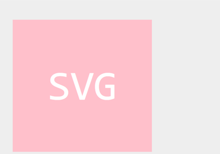

# SVG Logo Maker

## Description
In this challenge, I built a Node.js command-line application that takes in user input to generate a logo. The user is promted to provide a text for the logo (limit of 3 characters), to select a shape (circle, square, or triangle), to provide a color for a text and shapre using color keywords or hexadecimal numbers and to save the generated SVG to an .svg file.

## Table of Contents
* [Installation](#installation)
* [Usage](#usage)
* [Contributing](#contributing)
* [Tests](#tests)
* [Review](#review)
* [Contact](#contact)

## Installation
Clone this project repository to your computer. Use the terminal to run the commands:
- Use the command "npm install" to install application dependecies. 
- Use the command "npm install --save-dev jest" to install Jest as a devDependency.

## Usage
Navigate to the project folder in the terminal. 
Invoke the application by typing "node index.js" in the terminal's command line. 

### Screenshots
A command-line application that accepts user input to generate a log:
- If text contains more than 3 characters, user will be prompted to try again. 

- If color is not a valid color keyword or hexadecimal number, user will be prompted to try again.

- Options to select a shape (circle, square, or triangle).

- Once all prompts have been answered, a logo 'logo.svg' will be generated in the 'examples' folder and the message "Generated logo.svg" is printed in the command line.
 

Examples of Generated Logos:

Refer to the video posted in the [Review](#review).

## Contributing
[Check if a color is valid in javascript](https://www.codeease.net/programming/javascript/how-to-check-if-a-color-is-valid-in-javascript#:~:text=Here%2C%20we%20are%20going%20to%20discuss%20some%20of,document.createElement%28%22div%22%29%3B%20%20...%203%203.%20Using%20Canvas%20API%3A)

## Tests
The application includes tests for Triangle, Circle, and Square classes using Jest. Each shape class is tested for a render() method that returns a string for the corresponding SVG file with the given shape color. Type "npm test" in the command line to run the tests.

## Review
The walkthrough video that demonstrates application functionality: [video](https://drive.google.com/file/d/1rrpSvljS7d8oLXvtP_Exf1O_jgIqfTz6/view?pli=1)

## Contact
Contact me with any ideas or requests: akravt1274@gmail.com
